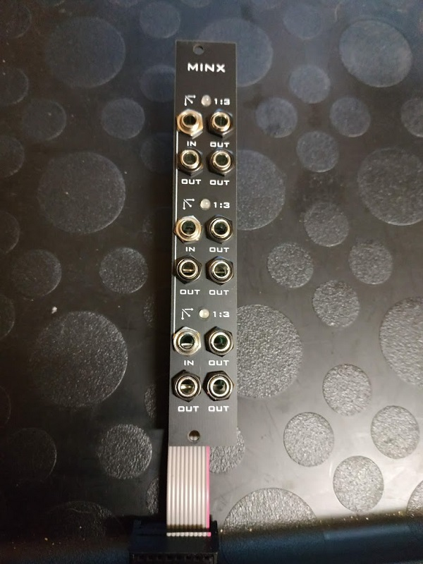

i noticed that there is no panel in forestcaver's repo, so i made one, the bottom led is bit tilted, but not noticable when assembled, so leaving as is  

# Minx_AJH
Buffered multiple based on Mutable Instruments Links

v1.1 normals the first input jack to ground (if you have v1.0 boards - it's trivial to just jumper the jack !)

BOM spreadsheet is untested - I havent built from this BOM ! Pls check carefully if you use it.

CC_BY_SA 3.0  
original design by emilie gillet   
rework by forestcaver   
panel by me   
